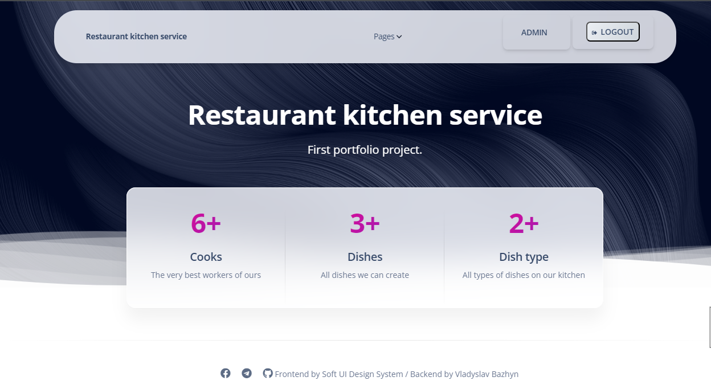

# Restaurant_kitchen_service project

Django project for managing cooks, dish, and ingredients on kitchen

## Check it out!

[Restaurant_kitchen_service project deployed to Render](#)

## Installation

Python3 must be already installed

'''shell
git clone https://github.com/VladyslavBazhyn/restaurant_kitchen_service
cd restaurant_kitchen_service
python3 -m venv venv
source venv/bin/activate
pip install -r requirements.txt
python manage.py runserver # Start django server
'''

## Features

* Authentication functionality for Cook/User
* Managing dish, dish types, ingredients, cook directly from visible interface
* Powerful admin panel for advanced managing

## Demo

## For inspection of all features use this test user:
Username: Test_user_1
Parol: test123test
